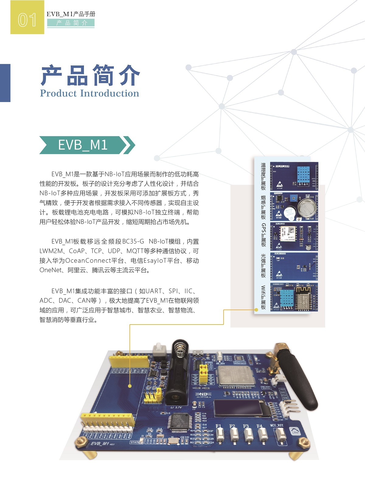
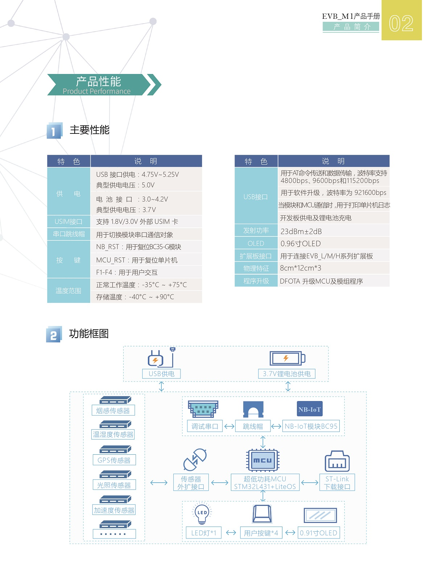
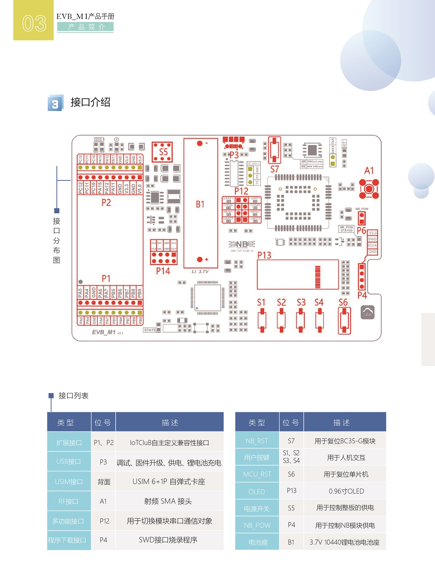

# 《EVB_M1》
------

## EVB_M1资料说明

本仓库提供了三个文件夹

- Documents
    - 该文件夹中所存是的EVB_M1开发板的相关介绍文件
- EVB_M1 Code (MDK)
    - 该文件夹为英文版EVB_M1相关案例代码，代码已开源，为华为liteOS版本，开源案例如下：

实验列表|项目|扩展板名称|应用案例
---|---|---|---|
实验一|EVB_M1 温湿度监测|温湿度扩展板|智慧农业
实验二|EVB_M1 烟雾报警器|烟雾扩展板|智慧消防|
实验三|EVB_M1 GPS定位|定位扩展板|Trace跟踪
实验四|EVB_M1 光照强度监测|光照传感器|智慧路灯
实验五|EVB_M1 Wifi+LWM2M 电信平台接入|无线设备接入|智能家居

- EVB_M1源代码（MDK）
    - 该文件夹为中文版EVB_M1相关案例代码，代码已开源，为华为liteOS版本，开源案例如下：

实验列表|项目|扩展板名称|应用案例
---|---|---|---|
实验一|EVB_M1 温湿度监测|温湿度扩展板|智慧农业
实验二|EVB_M1 烟雾报警器|烟雾扩展板|智慧消防|
实验三|EVB_M1 GPS定位|定位扩展板|Trace跟踪
实验四|EVB_M1 光照强度监测|光照传感器|智慧路灯
实验五|EVB_M1 Wifi+LWM2M 电信平台接入|无线设备接入|智能家居

## 开发实战教程列表
- [x] [程序烧录指南](./Documents/Program_Burning_Guide.md)
- [x] [工程导入教程](./Documents/Project_Import_Tutorial.md)
- [x] [开发环境配置指南](./Documents/Development_Environment_Configuration_Guide.md)
- [x] [硬件连接及配置教程](./Documents/Hardware_Connection_and_Configuration_Tutorial.md)
- [ ] [EVB_M1 串口调试NB-IoT入门篇]()
- [ ] [EVB_M1 华为平台接入手册]()
- [ ] [EVB_M1 使用手册V1.0]()
- [ ] [EVB_M1 视频教程]()

物联网俱乐部[淘宝店铺1](http://iot-club.taobao.com)  
物联网俱乐部[淘宝店铺2](https://shop449662000.taobao.com)

更多资料欢迎点击访问[物联网俱乐部](http://www.iotclub.net)论坛

